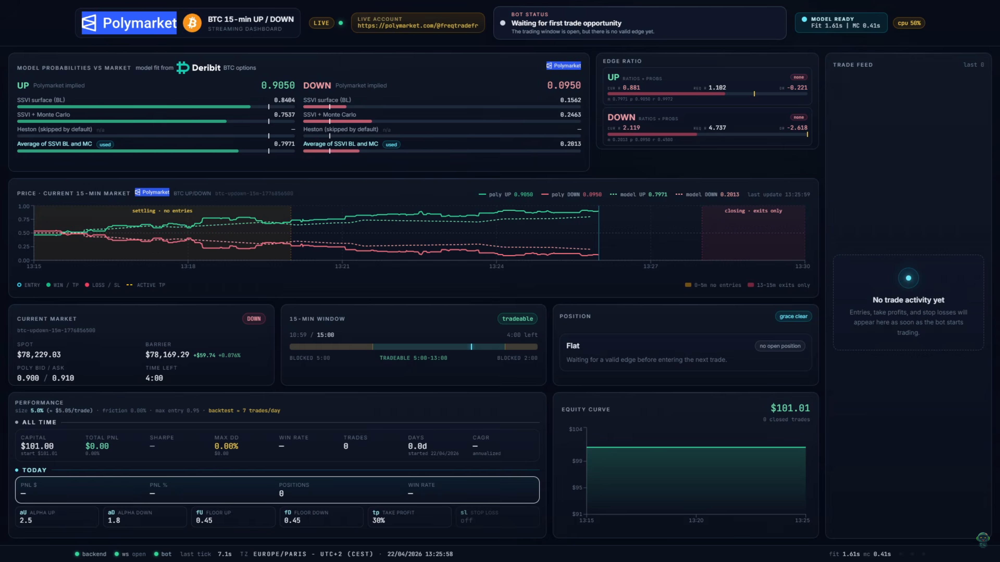

# Polymarket Streaming Dashboard

Real-time dashboard and Windows-friendly manager for the sibling
`../BTC_pricer_15m/` Polymarket bot.

The dashboard shows the selected dry-run parameter set or the active live trader:

- Model probabilities from SSVI / Monte Carlo / optional Heston outputs.
- Polymarket market-implied probabilities from the CLOB book.
- Current edge ratio and required edge ratio for the active alpha/floor params.
- Current 15-minute market, BTC spot, barrier, direction, and time to expiry.
- Position state, TP/SL levels, grace-period status, and live/paper mode.
- Performance, equity curve, recent trades, and leaderboard in dry-run mode.
- Calibration status and the time between usable model updates.

The UI is locked to a 16:9 frame for clean OBS capture at 1920x1080.

<p align="center">
  
</p>

## Prerequisites

- Windows PowerShell.
- Docker Desktop available from Windows PowerShell.
- Python 3.10+ for the dashboard backend.
- Node 20+ for the Vite frontend.
- The sibling bot checkout at `../BTC_pricer_15m/`.

For BTC bot development and tests, always use the `btc_pricer` conda
environment. The dashboard manager itself can run with the normal Windows
Python used by this repository.

## Quick Start

From this dashboard folder:

```powershell
python .\manage.py start
python .\manage.py status
```

Open <http://127.0.0.1:5174>.

`manage.py start` starts the 864-instance paper grid plus hidden dashboard
backend/frontend processes. Closing the terminal does not stop the dashboard.
Use this when you only want to restart the dashboard UI/API without touching the
grid:

```powershell
python .\manage.py restart --no-grid
```

Ports:

- Backend/API/WebSocket: <http://127.0.0.1:8799>
- Frontend: <http://127.0.0.1:5174>

Logs are written under `logs/`; PID files are written under `runtime/`.

## Live Location

The dashboard stays local. Only the single live trader can move between local
execution and the configured VPS.

```powershell
python .\manage.py live status
python .\manage.py live local
python .\manage.py live vps
python .\manage.py live stop
```

`live vps` currently targets the Ireland profile in `vps_infos/infos.txt`.
The old US East VPS was deleted and should not be used. The 864-instance dry-run
grid remains local.

When live is on the VPS:

- The VPS container executes real orders and writes live state.
- A local sync loop mirrors live state back into `../BTC_pricer_15m/results/`
  for the dashboard.
- A local offload container can send fast local calibration/probability events
  into the VPS `results/calibration_inbox/`.
- The VPS live trader also calculates its own calibration and uses the hybrid
  calibration broker to consume both sources safely.

Provision or refresh the VPS from this dashboard folder:

```powershell
python .\manage.py setup-vps
```

## Mode

Switch the dashboard view with `.env`:

```env
MODE=live
# or
MODE=dry_run
```

Then restart the dashboard process:

```powershell
python .\manage.py restart --no-grid
```

In live mode the backend reads `15m_live_state.json`, `15m_live_trades.csv`,
and `15m_live_equity.csv`. In dry-run mode it reads the grid snapshot,
leaderboard, and paper trade history.

## Tests

```powershell
cd backend
python -m pytest tests/ -q
```

## Architecture

- Backend: FastAPI on port `8799`, file polling, typed state models, and
  WebSocket updates.
- Frontend: React + Vite + Tailwind + Zustand, with recharts and framer-motion.
- Manager: `manage.py` starts/stops dashboard processes, controls the paper
  grid, and drives live switching/provisioning via the sibling `live_manager.py`
  (no shell wrappers — everything runs in Python).
- Bot results: read from the sibling `../BTC_pricer_15m/results/` directory.

Dashboard-only browsing is read-only. Operational commands such as
`manage.py live ...` and `manage.py setup-vps` intentionally manage bot/VPS
state, so use `python .\manage.py status` before switching live execution.
